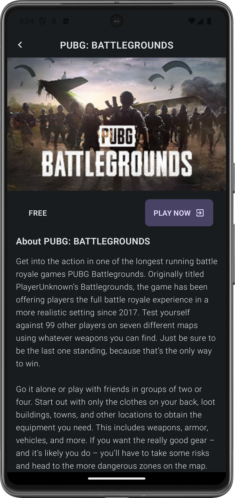
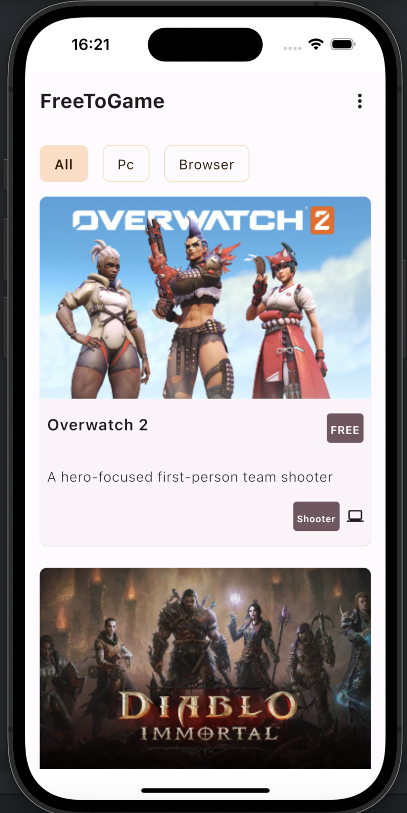
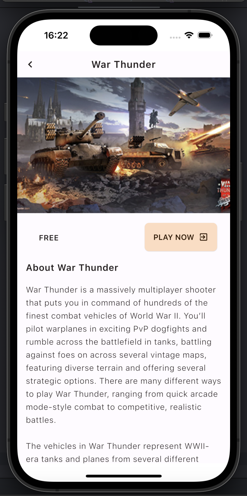
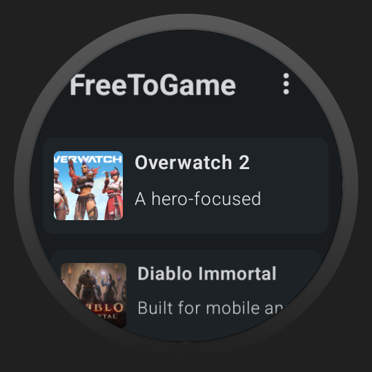

# FreeToGame
This is a KMP project for Android, IOS, Desktop and Wear Os with shared UI using Compose UI. The project consumes data from the [FreeToGame Api](https://www.freetogame.com/api-doc).
The project supports Dynamic colors for Android, and light and dark thems for all platforms

`Note`

`
The plans to complete the Desktop and Web features are underway. You can also take this as an opportunity to contribute by working on these features 🥳`

## Platforms
Android | IOS | Wear OS| Desktop | Web |
:----: | :----: | :----: | :----: | :----:
✅ | ✅ | ✅ | 


## Screenshots
#### Android
| | |
|:-------------------------:|:-------------------------:|
| |  

#### IOS
| | |
|:-------------------------:|:-------------------------:|
| |  

#### Wear OS
| | |
|:-------------------------:|:-------------------------:|
| |  

#### Desktop && Web
The plans to complete the `Desktop` and `Web` features are underway. You can also take this as an opportunity to contribute by working on these features 🥳


## Demo
#### Android

https://github.com/Felix-Kariuki/FreeToGame/assets/61313608/6a4400b3-1e19-4cf9-86cf-b3bda85fc011


#### IOS


https://github.com/Felix-Kariuki/FreeToGame/assets/61313608/78a60290-e0e7-4582-9be6-4d35fd34d0f5


#### Wear OS


https://github.com/Felix-Kariuki/FreeToGame/assets/61313608/9ab6ff77-55e8-4218-b40c-ed5a1a1bcc89


#### Desktop && Web
The plans to complete the `Desktop` and `Web` features are underway. You can also take this as an opportunity to contribute by working on these features 🥳

## Tech Stack
- [Kotlin Multiplatform](https://kotlinlang.org/docs/multiplatform.html) - The Kotlin Multiplatform technology is designed to simplify the development of cross-platform projects. It reduces time spent writing and maintaining the same code for different platforms while retaining the flexibility and benefits of native programming.
- [Compose Multiplatform](https://www.jetbrains.com/lp/compose-multiplatform/) -  Declarative framework for sharing UIs across multiple platforms. Based on Kotlin and Jetpack Compose.

- [Koin](https://insert-koin.io/) - A framework to help you build any kind of Kotlin & Kotlin Multiplatform application, from Android mobile, Multiplatform apps to backend Ktor server applications Koin is developed by Kotzilla and open-source contributors
- [Voyager](https://voyager.adriel.cafe/) - A multiplatform navigation library built for, and seamlessly integrated with, Jetpack Compose.
- [Kotlinx-serilization](https://github.com/Kotlin/kotlinx.serialization) - Kotlin multiplatform / multi-format serialization.
- [ktor](https://ktor.io/docs/welcome.html) - Ktor is a framework to easily build connected applications – web applications, HTTP services, mobile and browser applications.
- [Compose Components Resources](https://mvnrepository.com/artifact/org.jetbrains.compose.components/components-resources) - Resources For Compose Multiplatform.
- [Kotlin](https://kotlinlang.org/docs/getting-started.html) - Kotlin is a modern but already mature programming language designed to make developers happier. It's concise, safe, interoperable with Java and other languages, and provides many ways to reuse code between multiple platforms for productive programming.
- [Material3](https://developer.android.com/jetpack/androidx/releases/compose-material3) -  Material 3 includes updated theming and components and Material You personalization features like dynamic color, and is designed to be cohesive with the new Android 12 visual style and system UI.


## Project structure

### Modules

### 1.shared

This is a Kotlin module that contains the logic common for both Android and iOS applications, that is, the code you share between platforms.

This `shared` module is also where all the  Compose Multiplatform code is witten.

It uses Gradle as the build system. You can add dependencies and change settings in `shared/build.gradle.kts`.
The `shared` module builds into an Android library and an iOS framework.

### 2.androidApp

This is a Kotlin module that builds into an Android application. 
The `androidApp` module depends on and uses the `shared` module as a regular Android library.

### 3.iosApp

This is an Xcode project that builds into an iOS application.
It depends on and uses the `shared` module as a CocoaPods dependency.

### 4.Wear
This is a Kotlin module that builds into an Wear OS application. 
The `wear` module depends on and uses the `shared` module as a regular Android library.

### 5.desktopApp


### 6.Web


## License and Copyright ©️
[LICENSE](https://github.com/Felix-Kariuki/FreeToGame/blob/main/LICENSE)

  ```
     Copyright©️ 2024 Felix Kariuki

   Licensed under the Apache License, Version 2.0 (the "License");
   you may not use this file except in compliance with the License.
   You may obtain a copy of the License at

       http://www.apache.org/licenses/LICENSE-2.0

   Unless required by applicable law or agreed to in writing, software
   distributed under the License is distributed on an "AS IS" BASIS,
   WITHOUT WARRANTIES OR CONDITIONS OF ANY KIND, either express or implied.
   See the License for the specific language governing permissions and
   limitations under the License.
  
  ```

 ## Reach Out 

  * [Twitter](https://twitter.com/felixkariuki_)

  * [LinkedIn](https://www.linkedin.com/in/felix-kariuki/)
 
  <a href="https://www.buymeacoffee.com/felix.kariuki" target="_blank"></a>
